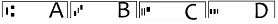

**!!New!!** <br />
SDK to detect and recognize MICR lines released at https://github.com/DoubangoTelecom/ultimateMICR-SDK <br />
<hr />

# Table of Contents
  1. [The dataset](#the-dataset)
  2. [The models](#the-models)
  3. [The recognizer app](#the-recognizer-app)
  4. [The accuracy](#the-accuracy)
  5. [Getting help](#getting-help)

<hr />

## The dataset <a name="the-dataset"></a>
The dataset contains more than __#11 thousands__ images (__.tif__) with ground truth (__.gt.txt__) from real life augmented with few synthetic data.

The dataset is ready to be used with tesseract v4 for training.

## The models <a name="the-models"></a>
If you're lazy and don't want to train the model by yourself then, try the ones under __tessdata_best__ (*float-model*) or __tessdata_fast__ (*int-model*) folders.

## The recognizer app <a name="the-recognizer-app"></a>
Most of the time when developing an ocr app using tesseract and you’re getting low accuracy it’s hard to determine if the issue is the model/traineddata or the image pre-processing. Off course you can dump the pre-processed image to see if it’s correctly binarized but this take time if you want to compute an accuracy score on thousands of images. 
To make your life easier this repo contains a command line application for Windows to test the accuracy. 

This app is very easy to use:
  1. add your images in *tesseractMICR/apps/images* 
  2. run *tesseractMICR/apps/tesseract_recognizer.bat*
  3. the predictions will be in *tesseractMICR/apps/ocr.txt*
  
This app will:
  1. detect MICR E-13B lines from anywhere on the image
  2. extract the lines, de-skew and de-slant them
  3. binarize the lines
  4. use Tesseract for recognition
  
You can edit *tesseractMICR/apps/tesseract_recognizer.bat* to change the path to the images or tessdata folders.
```
REM Usage: tesseract_recognizer.exe path_to_images_folder path_to_tessdata_folder
REM path_to_images_folder -> relative or absolute path to folder containing the images to process
REM path_to_tessdata_folder -> relative or absolute path to folder containing *.traineddata files
REM example: tesseract_recognizer.exe ./images ../tessdata_fast
REM another example: tesseract_recognizer.exe ./images ../tessdata_best

tesseract_recognizer.exe ./images ../tessdata_fast
```
The charset used in *tesseractMICR/apps/ocr.txt* is:



This application is GPGPU accelerated using OpenCL. Make sure to update your drivers.
  
 ## The accuracy <a name="the-accuracy"></a>
This was developed as an internal R&D project and never went to production as we ended using Tensorflow.

Even as a PoC (Proof-Of-Concept) it's already more accurate than all commercial products we've tested: [LEADTOLS](https://demo.leadtools.com/JavaScript/BankCheckReader/), [accusoft](http://download.accusoft.com/micrxpress/MICRXpressDemonstration.exe), [recogniform](http://www.recogniform.net/eng/micr-e13b-sdk.html) and [abbyy](https://www.abbyy.com/ocr_sdk/).
The repo contains a command line application to compare the accuracy ([see above](#the-recognizer-app)).

You can check our state of the art implementation based on Tensorflow at https://www.doubango.org/webapps/micr/ <br />

## Getting help <a name="getting-help"></a>

To get help please check our [discussion group](https://groups.google.com/forum/#!forum/doubango-ai) or [twitter account](https://twitter.com/doubangotelecom?lang=en)

